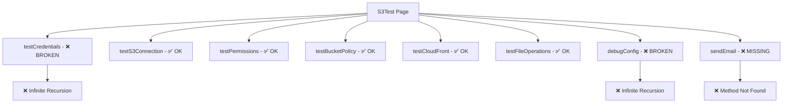

# S3Test Critical Errors Analysis

## Problemi Critici Identificati

### 1. **Errore Ricorsione Infinita - Metodo testCredentials()**
**File**: `S3Test.php` - Riga 150
```php
public function testCredentials(): void
{
    $this->debugResults['credentials'] = $this->testCredentials(); // ❌ RICORSIONE INFINITA
    $this->updateDebugOutput();
}
```

**Problema**: Il metodo pubblico `testCredentials()` chiama se stesso invece del metodo privato.
**Impatto**: Stack overflow, crash dell'applicazione.

### 2. **Errore Ricorsione Infinita - Metodo debugConfig()**
**File**: `S3Test.php` - Riga 183
```php
public function debugConfig(): void
{
    $this->debugResults['config'] = $this->debugConfig(); // ❌ RICORSIONE INFINITA
    $this->updateDebugOutput();
}
```

**Problema**: Il metodo pubblico `debugConfig()` chiama se stesso invece del metodo privato.
**Impatto**: Stack overflow, crash dell'applicazione.

### 3. **Funzione Debug in Produzione**
**File**: `S3Test.php` - Riga 568, 577
```php
dddx($results); // ❌ Debug function in produzione
dddx(['error' => $e->getMessage(), 'trace' => $e->getTraceAsString()]); // ❌ Debug function
```

**Problema**: Uso di `dddx()` che è una funzione di debug e interrompe l'esecuzione.
**Impatto**: L'applicazione si blocca invece di continuare l'esecuzione normale.

### 4. **Metodo sendEmail Non Implementato**
**File**: `S3Test.php` - Riga 98
```php
Action::make('sendEmail')
    ->submit('sendEmail'), // ❌ Metodo non esiste
```

**Problema**: L'azione riferisce a un metodo `sendEmail()` che non è implementato.
**Impatto**: Errore quando l'utente clicca sul pulsante.

### 5. **Stringhe Non Tradotte**
**File**: `S3Test.php` - Varie righe
```php
'Run tests to see results...' // ❌ Stringa hardcoded
```

**Problema**: Alcune stringhe non utilizzano il sistema di traduzione.
**Impatto**: Interfaccia non localizzata correttamente.

## Analisi Sicurezza

### Potenziali Vulnerabilità
1. **Esposizione Credenziali**: Le credenziali AWS potrebbero essere esposte nei log di debug
2. **Information Disclosure**: Stack trace completi esposti tramite dddx()
3. **Resource Exhaustion**: Ricorsione infinita può causare esaurimento risorse server

### Livello Gravità
- **Ricorsione Infinita**: 🔴 **CRITICO** - Causa crash immediato
- **Debug Functions**: 🟡 **MEDIO** - Problemi UX e potenziali leak informazioni
- **Missing Methods**: 🟡 **MEDIO** - Errori runtime quando utilizzato
- **Non-translated Strings**: 🟢 **BASSO** - Problema di localizzazione

## Dipendenze Coinvolte

### Servizi AWS
- **S3**: Amazon Simple Storage Service
- **CloudFront**: Content Delivery Network
- **STS**: Security Token Service
- **IAM**: Identity and Access Management

### Packages Laravel
- `Illuminate\Support\Facades\Storage`
- `Modules\Xot\Actions\CloudFront\GetCloudFrontSignedUrlAction`
- `Filament\Notifications\Notification`

### File di Configurazione
- `config/filesystems.php` - Configurazione S3
- `config/services.php` - Configurazione CloudFront
- `.env` - Variabili ambiente AWS

## Architettura Test AWS



## Impatto Funzionale

### Metodi Funzionanti ✅
- `testS3Connection()` - Test connessione bucket
- `testPermissions()` - Test permessi CRUD
- `testBucketPolicy()` - Verifica policy bucket
- `testCloudFront()` - Test configurazione CloudFront
- `testFileOperations()` - Test operazioni file
- `clearResults()` - Pulizia risultati

### Metodi Non Funzionanti ❌
- `testCredentials()` - Ricorsione infinita
- `debugConfig()` - Ricorsione infinita
- `sendEmail()` - Non implementato
- `save()` - Contiene dddx() che blocca esecuzione

### Funzionalità Compromesse
- **Test Credenziali AWS**: Non utilizzabile
- **Debug Configurazione**: Non utilizzabile
- **Invio Email Test**: Non utilizzabile
- **Salvataggio Form**: Si blocca su dddx()

## Piano di Correzione

### Priorità 1 - Correzioni Critiche
1. **Fix Ricorsione Infinita**: Correggere chiamate metodi
2. **Rimuovere dddx()**: Sostituire con logging appropriato
3. **Implementare sendEmail()**: Aggiungere metodo mancante

### Priorità 2 - Miglioramenti
1. **Traduzioni Complete**: Usare sistema traduzioni ovunque
2. **Error Handling**: Migliorare gestione errori
3. **Security Review**: Verificare esposizione credenziali

### Priorità 3 - Testing
1. **Unit Tests**: Test per ogni metodo
2. **Integration Tests**: Test con AWS reale/mock
3. **Error Scenario Tests**: Test gestione errori

## Standard di Qualità

### Best Practice da Seguire
- ✅ Namespace corretto: `Modules\UI\Filament\...`
- ✅ Estensione XotBasePage
- ✅ Sistema traduzioni completo
- ✅ Gestione errori robusta
- ✅ Logging appropriato (non debug functions)
- ✅ Type hints e PHPDoc completi

### Anti-Pattern da Evitare
- ❌ Ricorsione infinita
- ❌ Debug functions in produzione
- ❌ Stringhe hardcoded
- ❌ Metodi non implementati nelle azioni
- ❌ Esposizione credenziali sensibili

## Collegamenti

### Documentazione Correlata
- [AWS Test Bug Fix](./bugfix-awstest-undefined-variable.md)
- [S3Test Translations](../lang/it/s3test.php)
- [CloudFront Action](../../Xot/app/Actions/CloudFront/GetCloudFrontSignedUrlAction.php)

### Files Coinvolti
```
laravel/Modules/UI/
├── app/Filament/Clusters/Test/Pages/S3Test.php    # File con errori
├── lang/it/s3test.php                             # Traduzioni
├── resources/views/filament/clusters/test/pages/s3test.blade.php
└── docs/s3test-critical-errors-analysis.md       # Questa documentazione
```

*Analisi completata: Gennaio 2025*
*Gravità: CRITICA - Richiede correzione immediata*
