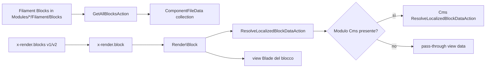

# Block rendering e servizi opzionali

## Scopo

Il modulo **UI** fornisce componenti Blade/Livewire riusabili per pagine marketing e admin. Due filiere distinte:

1. **Block CMS** — composizione pagina da blocchi JSON (Filament Blocks).
2. **Mappa interattiva** — widget Livewire con marker e filtri (opzionale senza modulo Geo).

## Catena di utilizzo — Block



| Artefatto | Ruolo | Consumer noti |
|-----------|-------|---------------|
| `GetAllBlocksAction` | Scansiona `Modules/*/Filament/Blocks/*.php` e produce catalogo `ComponentFileData` | Inventario componenti (`_components.json`); tooling admin (nessun caller PHP diretto nel mono attuale) |
| `View\Components\Render\Block` | Risolve view del singolo blocco + dati localizzati | `resources/views/components/render/blocks/v1.blade.php`, `v2.blade.php`; `User/resources/views/filament/pages/home.blade.php` (`<x-render.block>`) |
| `ResolveLocalizedBlockDataAction` | Bridge verso Cms opzionale | Solo `Render\Block::render()` |
| `Filament/Blocks/*` | Definizione schema blocchi (Page, Post, Contact, …) | Filament page builder cross-modulo |

## Catena di utilizzo — Mappa

| Artefatto | Ruolo | Consumer noti |
|-----------|-------|---------------|
| `InteractiveMap` (Livewire) | Marker, filtri, export, geocoding | `resources/views/livewire/components/map/interactive-map.blade.php`; integrazione documentata in `docs/map-integration-guide.md` |
| `MapServiceContract` | Contratto marker/stats/export | Registrato in `UIServiceProvider` → `NullMapService` di default |
| `GeocodingServiceContract` | Contratto ricerca indirizzi | `NullGeocodingService` di default |
| `NullMapService` / `NullGeocodingService` | Fallback quando Geo assente | Container Laravel (singleton) |

Quando il modulo **Geo** sarà installato, sostituire il binding in `UIServiceProvider` senza toccare `InteractiveMap`.

## Regola PHPStan

- Non importare `Modules\Geo\*` o `Modules\Cms\*` nel consumer UI.
- Usare contratti/action locali + `class_exists()` per delega opzionale.
- Array dinamici: normalizzare chiavi stringa prima del passaggio a servizi tipizzati (vedi [phpstan-dynamic-array-normalization](./phpstan-dynamic-array-normalization.md)).

## Verifica

```bash
cd laravel && ./vendor/bin/phpstan analyse Modules/UI
```
